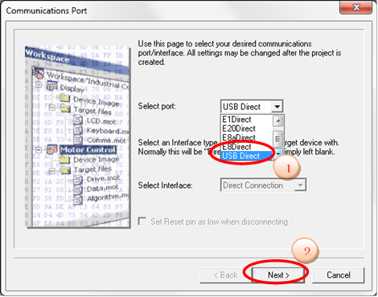

[Japanese version](./README.ja.md)

This is a demonstration of ROS2 running on microcontrollers using freertps.

This repository contains both RTPS code forked from the original [freertps](https://github.com/ros2/freertps) repository, and code for the target MCU (Renesas RX63N). This makes it possible to use ROS2 on the MCU by following the steps described below.


Demonstration overview
----------

This demonstration implements ROS2 on the GR-SAKURA II-Full board, which integrates a Renesas RX63N microcontroller.

Useful references:
ROSCon2017 lightning talk presentation [ROS2 implementation for MCUs]

https://roscon.ros.org/2017/presentations/ROSCon%202017%20Lightning%20110.pdf

ROSCon2017 Lightning Talks DAY1 video

https://vimeo.com/236129109#t=24m18s

RX63N

https://www.renesas.com/en-us/products/microcontrollers-microprocessors/rx.html

GR-SAKURA II-Full

http://gadget.renesas.com/en/product/sakura.html

There are two demonstrations, the procedures for which are described below.

* Hello world demonstration
Transmit/receive 'std_msgs/String' message

* Tilt control demonstration
Pan-tilt unit control using 'sensor_msgs/Joy' message


Hardware requirements
----------

(1) Two GR-SAKURA-II Full (referred to as SAKURA) boards. 

The boards may be purchased through the websites below.

http://in.element14.com/renesas/gr-sakura-full/32-bit-mcu-dev-board/dp/2311256

http://int.rsdelivers.com/productlist/search?query=GR-SAKURA&tag=&family=9584 

* SAKURA(Pub) Publisher node with a joystick shield
* SAKURA(Sub) Subscriber node to control the pan-tilt unit


(2) Arduino joystick shield

https://www.sainsmart.com/products/sainsmart-joystick-shied-expansion-board-for-arduino

This shield needs extra-height pin headers to have enough clearance for the RJ45 port.

(3) Pan-tilt unit

This is a custom pan-tile unit for this prototype and cannot be purchased. The subscriber sends goal position to each motor (x-y) by using UART and it is converted to RS-485 signal inside of the unit. You will need to design this unit for your target applications. Additional information is available in the appendix.

(4) Ethernet hub or switch

(5) Renesas E1 Emulator (optional)

This is necessary if you want to print received messages on the debug console for the “hello world” demonstration.

Connection diagram

```
 +---------------------+
 |    Joystick   　　  |
 +---------------------+
         | Arduino Shield I/F
 +---------------------+           +-----------------+
 |   SAKURA(Pub)  　　 +-----------+  Ethernet HUB   |
 +---------------------+  Ethernet +-------+---------+
   192.168.1.100                      　　 |
                                      　　 |
   192.168.1.101                      　　 |
 +---------------------+         　        |
 |   SAKURA(Sub) 　　  +-------------------+
 +---------------------+  Ethernet
         | UART　　　　　　　　　　　　　
 +---------------------+
 | Pan-Tilt unit       |
 +---------------------+
```

Software
----------

(1) Renesas C/C++ Compiler Package for RX Family

The evaluation version can be downloaded from the website. See the install instructions on the website.

https://www.renesas.com/en-us/software/D4000428.html

The evaluation version has limitations as described on the website. The version used for this demonstration was "V.6.00.00".

(2) Flash Development Toolkit 

The evaluation version can be downloaded from the website. See the install instructions on the website.

https://www.renesas.com/en-us/software/D3017335.html

The version used for this demonstration was "V.4.09 Release 03".


Get the source
----------
(1) Download the RX Family Sample Code that uses TCP/IP for Embedded system M3S-T4-Tiny Firmware Integration Technology

https://www.renesas.com/en-us/software/D6000790.html

(2) Unzip the files. You will need to edit the file below to change the divisor to '(2)' from '(4)' to support 1Mbps UART (this depends on the UART specification of your pan-tilt unit)

workspace/sample/rx63n_gr_sakura/r_config/r_bsp_config.h

```c
/* Peripheral Module Clock B Divider (PCKB).
   Available divisors = /1 (no division), /2, /4, /8, /16, /32, /64
*/
#define BSP_CFG_PCKB_DIV                (2)
```

(3) Download the freertps code for the RX63N

https://github.com/godzilla-max/freertps/archive/master.zip

Unzip the file into the directory below.

```
workspace/sample/rx63n_gr_sakura/
```

(4) Download the UART driver

https://github.com/godzilla-max/uart/archive/master.zip

Unzip the file into the directory below.

```
workspace/sample/rx63n_gr_sakura/
```

The file structure created by steps 1 to 4 should be as below.

```
workspace/sample/rx63n_gr_sakura/
|
|-- freertps/                     [freertps codes]
|   |
|   |-- apps/
|   |   |-- ...(SNIPPED)...
|   |   |-- rx63n_gr_sakura_joystick/ [Joystick control application]
|   |   |-- rx63n_gr_sakura_listener/ ["Hello world" message RX application]
|   |   |-- rx63n_gr_sakura_talker/   ["Hello world" message TX application]
|   |   |-- rx63n_gr_sakura_tilt_ctrl/[pan-tilt control application]
|   |   |-- ...(SNIPPED)...
|   |
|   |-- include/
|   |-- psm/
|   |-- r2/
|   |-- ros2_demos/
|   |-- rosmsg_apps/
|   |-- scripts/
|   |-- systems/
|   |   |-- ...(SNIPPED)...
|   |   |-- rx63n_gr_sakura/      [freertps RX63N abstraction S/W]
|   |   |-- ...(SNIPPED)...
|   |-- tests/
|   |-- tiny/
|   '-- utils/
|-- HardwareDebug/
|-- r_bsp/
|-- r_cmt_rx/
|-- r_config/
|-- r_ether_rx/
|-- r_pincfg/
|-- r_sys_time_rx/
|-- r_t4_driver_rx/
|-- r_t4_rx/
|-- src/
'-- uart/                         [UART driver S/W]
```

Build the project
----------

(1) Project conversion

   Reference document (see Chapter 5):

   https://www.renesas.com/en-us/doc/products/mpumcu/apn/rx/002/r20an0312ej0106-rx-t4.pdf

   SAKURA(RX63N) conversion setting


   (1-1) Start CS+ for CC and click the "GO" button in "e2 studio / CubeSuite / …".


   If you do not see a window like that shown above, click the start button.


   (1-2) Select the e2 studio project file 'rx63n_gr_sakura.rcpc' and click open.


   (1-3) The "Project Convert Settings" window will open. Select the project in the project tree.


   (1-4) In the project settings on the right side of project tree, for the microcontroller select 'RX64M' -> 'R5F563NYDxFP' and click OK. CS+ outputs the converted project.


   If you see the dialog below, click no.


   (1-5) Select 'CC-RX' in the project tree.


   (1-6) Make sure 'RXv1 architecture' is selected in the 'Instruction set architecture' menu. DO NOT change the architecture property.


   (1-7) Select '0 (-optimize=0)' for the optimization level under 'Frequently Used Options(for Compile)'


(2) Exclude all the files under '/src' from the build ('Project tree' -> 'File' -> 'src' -> right click -> 'Property')


(3) Drag and drop the directory below into 'File'

```
workspace/sample/rx63n_gr_sakura/uart
```


Set the subfolder search level to '10'.


(4) Add a new category and name it 'freertps'.


(5) Drag and drop the directories below into the 'freertps' category.

```
workspace/sample/rx63n_gr_sakura/freertps/apps
workspace/sample/rx63n_gr_sakura/freertps/include
workspace/sample/rx63n_gr_sakura/freertps/systems
workspace/sample/rx63n_gr_sakura/freertps/*.c
```


(6) Remove all the directories, except for the directories shown below, from the 'freertps/apps' directory in the project.

```
rx63n_gr_sakura_joystick
rx63n_gr_sakura_listener
rx63n_gr_sakura_talker
rx63n_gr_sakura_tilt_ctrl
```


(7) Remove all the directories except for 'rx63n_gr_sakura' from the project.


(8) Select the target application to be built by right clicking on the application.

```
rx63n_gr_sakura_joystick
rx63n_gr_sakura_listener
rx63n_gr_sakura_talker
rx63n_gr_sakura_tilt_ctrl
```

For example, to build the “Hello World” transmit application, select 'rx63n_gr_sakura_talker'.


(9) Add the directory below to 'Additional include paths' under 'Frequently Used Options (for Compile)'.

```
%ProjectFolder%/../%ProjectName%/freertps/include
```


(10) Start the build by selecting 'Build project' from the 'Build' menu.


A successful build shows the message below. The warning messages can be ignored.

```
------ Build ended(Error:0, Warning:0)(rx63n_gr_sakura_1_, HardwareDebug)  ------  
```

Programing the SAKURA board with the firmware
----------

Direct programming through onboard USB

(1) Set SW-3 (slide switch) of the SAKURA to boot mode.


(2) Connect the SAKURA board to the computer using a USB cable (USB mini-B cable).

(3) Reset the SAKURA board by pressing SW1 (red button).


(4) Start the Flash Development Toolkit.

(5) Create a new project.


(6) Input the name of the project ('test' in this example).


(7) Select 'Generic BOOT Device' under the 'Choose Device And Kernel' menu.


(8) Select 'USB Direct' for 'Select port:' under the 'Communications Port' menu



(9) Click OK if you see the dialog below.


(10) Select 'RX600 Series (LittelEndian)' under the 'Select a device' menu .


(11) Click OK


(12) Enter 12.00MHz for the CPU crystal frequency for the selected device tab under the 'Device Settings' menu


(13) Confirm the settings shown below and click on Done.

   * 'Protection' => 'Automatic'
   * 'Messaging' => 'Advanced'
   * 'Readback Verification' => 'No'


(14) For the data file to load, select the 'rx63n_gr_sakura' file.


(15) Select 'Download Active File' under the 'Device' menu to initiate flash programming.


The message below indicates that programming successfully completed.

```
Image written to device
```

(16) Close the Flash Development Toolkit.

(17) Set SW-3 (slide switch) of the SAKURA board to normal mode (the switch must be to the side marked 'RUN' on the board).

Programming using the E1 Emulator
----------

(1) Select 'RX E1(JTAG)' as the debug tool under the 'Debug' -> 'Using Debug Tool' menu of the CS+ tool.


(2) Select 'Download' under the 'Debug' menu. This initiates flash programming.


If the file download fails, select 'HOCO' for the 'Main clock source' of the 'Clock' category under the 'Connect Settings' tab.

Demonstration
----------

### Hello world demonstration

This demonstration requires the Renesas E1 Emulator to see the debug console output of the publisher node SAKURA board. It sends 'std_msgs/String' messages from the publisher node SAKURA board to the subscriber node SAKURA board.

(1) Build the code, selecting 'rx63n_gr_sakura_talker' for the target application, and program it to the publisher node SAKURA board.

(2) Build the code, selecting 'rx63n_gr_sakura_listener' for the target application, and program it to the subscriber node SAKURA.

(3) Power up the publisher node SAKURA board.

(4) Power up the subscriber node SAKURA board with the E1 Emulator connected.

(5) Start the CS+ Debugger by selecting the 'CS+ debug' menu.

(6) Start the subscriber node SAKURA board software by selecting the 'CPU reset-debug-run' menu.

(7) Successful operation will show the following output.

```
hello, world!
freertps INFO : udp init()
freertps INFO : ^^>>>user_cb<<< ch:0,eventID = ETHER_EV_LINK_ON
freertps INFO : frudp_generic_init()
freertps INFO : frudp_part_create() on domain_id 0
freertps INFO : frudp_init_participant_id()
freertps INFO : add ucast rx port 7410
....(SNIPPED)....
I heard: [Hello World: 4]
I heard: [Hello World: 5]
I heard: [Hello World: 6]
I heard: [Hello World: 7]
....(SNIPPED)....
```

Note: The publisher node and subscriber node SAKURA boards can be replaced by the 'talker' or 'listener' PC demonstration code from the standard ROS2 distribution. This can be done by executing the following commands on a PC (the below commands are for Linux or MacOS).

Publisher:

```
$ cd <ROS2 workspace>
$ . install/local_setup.bash
$ ros2 run demo_nodes_cpp  talker
```

Subscriber:

```
$ cd <ROS2 workspace>
$ . install/local_setup.bash
$ ros2 run demo_nodes_cpp listener_best_effort
```

### Tilt Control demonstration

Use a publishing SAKURA board to send 'sensor_msgs/Joy' messages and a subscribing SAKURA board to receive the messages and control the pan-tilt unit.

(1) Build the code, selecting 'rx63n_gr_sakura_joystick' for the target application, and program it to the publishing (joystick) SAKURA board.

(2) Build the code, selecting 'rx63n_gr_sakura_tilt_ctrl' for the target application, and program it to the subscribing (pan-tilt) SAKURA board.

(3) Power up the two boards.

(4) The pan-tilt unit should move when the joystick is moved.


Appendix
----------

### Additional information for the pan-tilt unit.

The pan-tilt unit is custom-built for this demonstration and cannot be purchased as-is. However, it is not difficult to construct. It uses two Dynamixel MX-64AR motors and the goal position for each is provided through a UART interface. The 'rx63n_gr_sakura_tilt_ctrl' application receives the joystick position and converts it to a goal position for each servo motor. UART signaling is converted to RS-485 inside the pan-tilt unit. The UART specification and command format is described below.

#### Interface specification to the Pan-Tilt unit

UART (SAKURA board serial1 channel, P20/TXD0, P21/RXD0)

Baud rate: 1M bps

Data format: 8 bits data, 1 bit stop bit, no parity, no flow control

#### Command format (send only)

Byte

1st header 0xFF (fixed)

2nd header 0xFF (fixed)

3rd motor ID (0x01:x 0x02:y)

4th 0x1E (fixed)

5th lowest byte of goal position (type: unsigned short, little endian)

6th highest byte of goal position

The goal position is defined as 2048 (upright) +218/-218 

[Dynamixel motor MX-64AR](http://support.robotis.com/en/product/actuator/dynamixel/mx_series/mx-64at_ar.htm)

Comments and discussion
----------

A new thread will be posted on the ROS Discourse.

Known issues/limitations
----------

* The parameter resolution for API frudp_listen() is 1 second. Set to "0.0f" if you need better resolution.
* FastRTPS on the PC was used to confirm communication between PC and the SAKURA board. No other middleware stacks were tested.

Disclaimer
----------

We will not be liable for damages or losses arising from your use or inability to use this demonstration. Use at your own risk.
